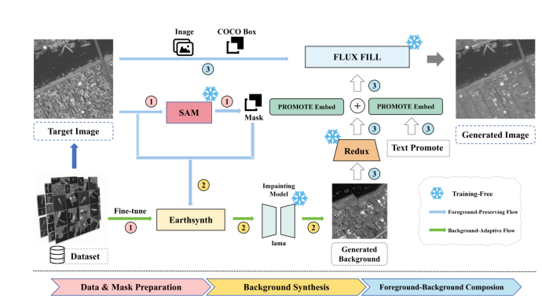

# FPBA-Syn: 遥感合成数据生成管线

**FPBA-Syn(Foreground-Preserving and Background-Adaptive Synth Pipeline)**——面向遥感目标检测的合成数据生成管线:
**背景自适应**(目标经微调 EarthSynth 擦除后按场景生成)→ **前景保留**(Stage3 在原位重绘/重建目标),产出可控、域一致的合成影像。

<p align="center"></p>


面向遥感目标检测(舰船/飞机/发射车)的**可控合成数据生成**:生成模型微调 → 三类影像生成 → 标注整合为训练集。
该管线产出的合成数据用于下游检测器的**合成预训练**(论文:两段式训练,详见检测侧仓库)。

## 结构

```
├── finetune/         三类 EarthSynth 微调复现(准备 SAM 数据 + diffusers train_controlnet 微调)
│   ├── airplane/         MAR20 → finetune_sam_5000(飞机)
│   ├── launch_vehicle/   v5 FSC → finetune_fsc_ckpts(发射车)
│   └── ship/             v3zip 舰船 → finetune_ship_1000
├── generate/        三类合成影像生成(完整一体脚本:Phase1 背景 + Stage3 Flux 成图)
│   ├── earthsynth_finaldatav2_airplane.py         飞机 → finaldatav2_airplane_3x_output
│   ├── earthsynth_finaldatav2_fsc_stage3.py       发射车 → finaldatav2_fsc_3x_output
│   └── earthsynth_finaldatav2_ship_stage3.py      舰船 → finaldatav2_ship_3x_output
├── annotate/        标注整合:生成输出 + 源标注 → 训练 COCO json
│   ├── make_synth_2of3_json.py(模板)
│   └── build_3x_full.py / build_synth_full_2of3_json.py / build_train_ship3x_full.py
└── weights_ref.md   生成侧大权重与数据资源引用(不随仓库发布)
```

## 方法概述

1. **微调(finetune/)**:每类独立复现 = `prepare_*_sam_data.py`(源图 + SAM 掩码 → conditioning/metadata)→ `train_earthsynth_*.sh`(HuggingFace diffusers `train_controlnet.py`:SD1.5 + EarthSynth 基座微调)。产物:飞机 `finetune_sam_5000`、发射车 `finetune_fsc_ckpts`、舰船 `finetune_ship_1000`。
2. **生成(generate/)**:每类一个一体脚本,两阶段:
   - Phase 1:微调 EarthSynth 将源影像中的目标擦除为干净背景(LaMa 辅助),输出 `bg/`;
   - Stage 3:Flux(Redux+Fill)在背景上重绘目标,输出每源多 rank 的 `final/*_rankK.png`(源去重后使用)。
   - 支持分片并行与断点续跑:`EARTHSYNTH_GPU=<g> PART_ID=<i> N_PART=<n> python xxx.py`。
3. **标注整合(annotate/)**:把生成影像与源 COCO 标注(类别与框)按输出映射整合为检测训练 json。

## 环境与资源

- Python 3.10, PyTorch, diffusers/transformers;EarthSynth/Flux/SAM/LaMa 等第三方模型与**数据不随仓库发布**,路径见 `weights_ref.md`(均为占位绝对路径,请替换)。
- 数据集:源影像与标注需按论文说明自备(本仓库仅提供生成与整合代码)。

## 引用与许可
(待补 bib / LICENSE;生成侧第三方模型遵循其各自许可)
